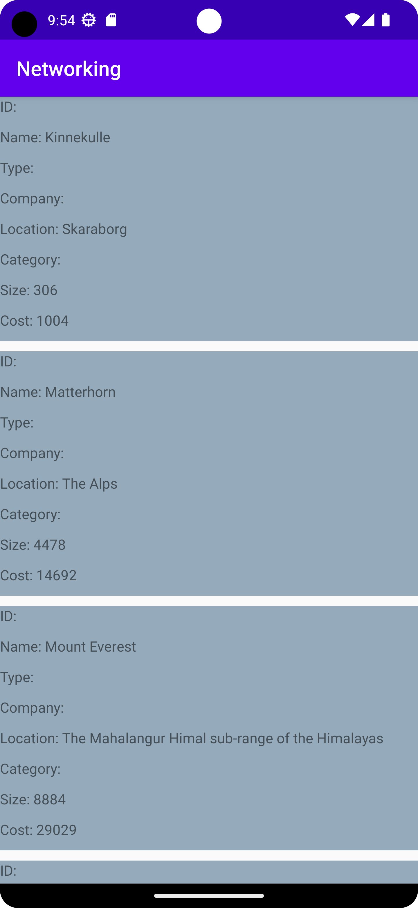

# Rapport

**Networking**

Uppgiften var att få ut data från en JSON fil samt URL och sedan presentera den i en RecyclerView.

I activity_main layout filen var RecyclerView tillagd och en ny layout list_items skapades för att visa upp data.

I list_items implementerades flera TextView.
```
            <TextView
            android:id="@+id/ID"
            android:layout_width="match_parent"
            android:layout_height="30dp"
            android:text="ID: " />
```

En ny klass Mountain, skapades vilket innehåller en konstruktor med data och getters/setters.
```
public Mountain(String ID, String name, String type, String company, String location,
                    String category, int size, int cost) {
        this.ID = ID;
        this.name = name;
        this.type = type;
        this.company = company;
        this.location = location;
        this.category = category;
        this.size = size;
        this.cost = cost;
    }
```

Adapter klassen var skapad som innehåller både array och ViewHolder.

onBindViewHolder setter data in i TextViews:
```
@Override
    public void onBindViewHolder(@NonNull ViewHolder holder, int position) {

        Mountain item = this.MountainsList.get(position);
        holder.Name.setText("Name: " + item.getName()); // Name
        holder.Company.setText("Company: " + item.getCompany()); // Company
        holder.Location.setText("Location: " + item.getLocation());
        holder.Category.setText("Category: " + item.getCategory()); // Category
        holder.Size.setText("Size: " + Integer.toString(item.getSize())); //
        holder.Cost.setText("Cost: " + Integer.toString(item.getCost())); // Cost
    }
```

ViewHolder innehåller TextViews och konstruktor:
```
public class ViewHolder extends RecyclerView.ViewHolder {

        private final TextView Name;
        private final TextView Company;
        private final TextView Location;
        private final TextView Category;
        private final TextView Size;
        private final TextView Cost;

        public ViewHolder(@NonNull View itemView) {
            super(itemView);
            this.Name = itemView.findViewById(R.id.Name);
            this.Company = itemView.findViewById(R.id.Company);
            this.Location = itemView.findViewById(R.id.Location);
            this.Category = itemView.findViewById(R.id.Category);
            this.Size = itemView.findViewById(R.id.Size);
            this.Cost = itemView.findViewById(R.id.Cost);
        }
    }
```

I MainActivity inom onPostExecute skapas en JSONArray och JSONObject och sedan extraheras data från objektet.
```
@Override
    public void onPostExecute(String json) {
        Log.d("MainActivity", json);
        if (json != null) {
            try {
                // Parse the JSON
                JSONArray jsonArray = new JSONArray(json);
                for (int i = 0; i < jsonArray.length(); i++) {
                    JSONObject jsonObject = jsonArray.getJSONObject(i);

                    // Extracting from JSON object
                    String name = jsonObject.getString("name");
                    String ID = jsonObject.getString("ID");
                    String type = jsonObject.getString("type");
                    String company = jsonObject.getString("company");
                    String location = jsonObject.getString("location");
                    String category = jsonObject.getString("category");
                    int size = jsonObject.getInt("size");
                    int cost = jsonObject.getInt("cost");

                    myAdapter.MountainsList.add(new Mountain(ID, name, type, company, location, category, size, cost));
                }

                // Notify for changes
                myAdapter.notifyDataSetChanged();

            } catch (JSONException e) {
                e.printStackTrace();
            }
        }
    }
```


Screenshot:

